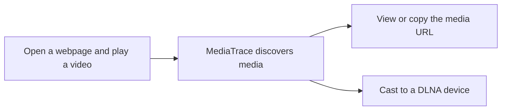

<p align="center">
  
</p>

<h1 align="center">MediaTrace</h1>

<p align="center"><a href="README.md">简体中文</a> · <strong>English</strong></p>

<p align="center">
  Discover media URLs on the current webpage in Safari, Chrome, and Microsoft Edge, then cast them to a DLNA device on your local network.
</p>

<p align="center">
  M3U8 · MP4 · FLV · M4S · Web media segments · DLNA casting
</p>

---

## What It Does

Open a video website and start playback. MediaTrace displays the number of detected media resources on its browser toolbar icon. Click the icon to view media URLs, duration, and live/VOD type, copy an address, or cast it to a TV.



> **DRM-protected websites are not supported.** MediaTrace only displays ordinary media URLs already accessed by the webpage. It does not support DRM-protected video and does not bypass DRM, authentication, or website access controls.

## Requirements

| Browser | Requirements |
| --- | --- |
| Safari on macOS | macOS 12.3 or later and Xcode |
| Safari on iPhone/iPad | iOS/iPadOS 15.4 or later and Xcode |
| Chrome on macOS | Chrome; the local native service is also required for DLNA discovery |
| Microsoft Edge on macOS | Edge; the same local native service is required for DLNA discovery |
| Chrome / Edge on Windows | Windows 10 version 1809 or later (Windows 11 recommended); end users installing the Setup package do not need Visual Studio or the .NET SDK |

> **Safari builds must be signed.** The macOS, iOS, and iPadOS versions consist of a host app and a Safari Extension. Both targets must use the same valid Apple Developer Team and must be signed successfully before the system can install and display the extension. A compiled but unsigned build may not appear in Safari Settings at all.

## Installing on Chrome

### 1. Load the extension folder

1. Open `chrome://extensions` in Chrome.
2. Enable **Developer mode** in the upper-right corner.
3. Click **Load unpacked**.
4. Select the project folder:

   ```text
   ~/Desktop/MediaTrace
   ```

5. Pin MediaTrace so its icon remains visible on the browser toolbar.

After changing the extension code, return to `chrome://extensions` and click **Reload** on the MediaTrace card.

### Install on Microsoft Edge

Edge uses the same extension folder and build artifact; no separate codebase is required:

1. Open `edge://extensions`;
2. Enable **Developer mode**;
3. Click **Load unpacked**;
4. Select `~/Desktop/MediaTrace`;
5. Pin MediaTrace to the Edge toolbar.

After changing code, click **Reload** at `edge://extensions`. `npm run build:edge` and `npm run build:chrome` produce the same Chromium-compatible CRX.

### 2. Install and sign the SSDP native service

A Chrome extension cannot send SSDP UDP multicast packets by itself. To discover TVs and other DLNA devices, install the Native Messaging Host once on the Mac.

Chrome reads user-level Native Messaging Host registrations from:

```text
~/Library/Application Support/Google/Chrome/NativeMessagingHosts/
```

Microsoft Edge reads the corresponding registration from:

```text
~/Library/Application Support/Microsoft Edge/NativeMessagingHosts/
```

MediaTrace creates this registration file by default:

```text
~/Library/Application Support/Google/Chrome/NativeMessagingHosts/app.mediatrace.json
```

This is Chrome's native-host registration directory, not the folder selected with **Load unpacked**. The unpacked extension must still be loaded from the project root, such as `/Users/your-name/Desktop/MediaTrace`.

Open Terminal and run:

```bash
cd ~/Desktop/MediaTrace
npm run build:chrome
./scripts/install-chrome-native-host.sh
```

The installer asks for a shared Native Host Identifier:

```text
Native Host Identifier [app.mediatrace]:
```

Press Return to use the default, or enter your own identifier, for example `com.example.mediatrace.nativehost`. For unattended installation, use:

```bash
MEDIATRACE_NATIVE_ID=com.example.mediatrace.native \
  ./scripts/install-chrome-native-host.sh
```

The script writes the same value to the extension's `NATIVE_APP_ID`, the host JSON `name` and filename, and the native app's `CFBundleIdentifier`. The default is `app.mediatrace`.

Do not use the `*.Extension` identifier assigned to the Safari Extension. The installer rejects it to prevent the Chrome host and Safari extension from sharing the same local-network permission identity.

The installer uses ad-hoc signing by default. If the Keychain contains a valid Apple Development or Developer ID Application certificate, specify it as follows:

```bash
MEDIATRACE_NATIVE_ID=com.example.mediatrace.native \
MEDIATRACE_CODESIGN_IDENTITY="Developer ID Application: Example Name (TEAMID)" \
  ./scripts/install-chrome-native-host.sh
```

With an Apple-issued identity, `codesign` should report a Team Identifier, allowing macOS to retain local-network permission for the Native Host more reliably.

After confirmation, the script synchronizes `src/background.js` and `native-host/Info.plist`, creates matching host JSON files for Chrome and Edge, then builds and signs the native app. Reload the extension and fully restart the browser afterward.

The build and installer commands automatically:

- Generate or reuse `dist/chrome/mediatrace.pem` to preserve the Chrome extension ID;
- Write the PEM public key to `manifest.json`, giving unpacked and CRX installations the same extension ID;
- Compile the Swift SSDP native service;
- Sign the native service with macOS `codesign`;
- Register the Native Messaging Host;
- Add both the CRX ID and the current unpacked-extension ID to the allowlist.

Quit Chrome completely with `Command + Q`, then reopen it.

If Chrome has not yet flushed the current profile configuration to disk, pass the extension ID shown on `chrome://extensions` directly to the installer instead of editing JSON manually:

```bash
MEDIATRACE_CHROME_EXTENSION_ID=your-32-character-extension-id \
  ./scripts/install-chrome-native-host.sh
```

To verify Chrome's registration:

```bash
ls -la "$HOME/Library/Application Support/Google/Chrome/NativeMessagingHosts/"
cat "$HOME/Library/Application Support/Google/Chrome/NativeMessagingHosts/app.mediatrace.json"
```

To verify the signature:

```bash
codesign --verify --deep --strict --verbose=2 \
  "$HOME/Library/Application Support/MediaTrace/MediaTrace Native Host.app"
```

No output means signature verification succeeded.

> `mediatrace.pem` is a private key. Never share it, commit it to a public repository, or delete it. Repackaging after deleting the key changes the extension ID and requires reinstalling the Native Host.

### Install on Windows Chrome / Edge

#### End users: one-click Setup package (recommended)

Download the installer matching the computer architecture from Releases:

- Most Intel/AMD computers: `MediaTrace-Setup-version-x64.exe`;
- Windows on Arm computers: `MediaTrace-Setup-version-arm64.exe`.

The installer deploys the precompiled self-contained Native Host, creates a stable extension ID, registers installed Chrome/Edge browsers, installs the extension files, and opens both the extensions page and the correct `Extension` folder.

End users **do not need Visual Studio, Visual Studio Build Tools, the .NET SDK, or Node.js**.

Chrome/Edge security policy does not allow an off-store extension to be silently enabled by a third-party EXE. Complete this one-time browser step after Setup finishes:

1. Enable **Developer mode** on the extensions page;
2. Click **Load unpacked**;
3. Select the `Extension` folder opened by Setup;
4. Fully quit and reopen the browser.

Allow private-network access if Windows Firewall prompts, or SSDP/DLNA responses may be blocked.

#### Windows build requirements and minimum versions

The following tools are required only by **project maintainers building Setup**, not by end users:

- Minimum OS: 64-bit Windows 10 version 1809 or Windows 11;
- Minimum shell: Windows PowerShell 5.1;
- Required toolchain: [.NET 8 SDK](https://dotnet.microsoft.com/download/dotnet/8.0) 8.0.100 or later. The **SDK** is required; installing only the .NET Runtime is not sufficient;
- Visual Studio is **not required** because the installer builds the Native Host with `dotnet publish`;
- To open and build the project in Visual Studio, use **Visual Studio 2022 17.8** or later and install the **.NET desktop development** workload, or install the .NET 8 SDK separately;
- Visual Studio Build Tools are not required by the installer either. If they are installed, `dotnet --version` must still report 8.0.100 or later.
- Building `MediaTrace-Setup.exe` also requires Node.js 18+ and Inno Setup 6.3+.

Build both installer architectures as a maintainer:

```powershell
.\scripts\build-windows-installer.ps1 -Architecture x64
.\scripts\build-windows-installer.ps1 -Architecture arm64
```

Outputs are written to `dist\windows\`. The **Build Windows Installers** GitHub Actions workflow can also be run manually and runs automatically for `v*` tags.

Verify the environment in PowerShell:

```powershell
dotnet --version
$PSVersionTable.PSVersion
```

If `dotnet` is unavailable or only the Runtime is installed, install the .NET 8 SDK matching the x64 or Arm64 system architecture and reopen PowerShell.

1. For media detection and URL copying only, load the project root directly from `chrome://extensions` or `edge://extensions`;
2. For DLNA discovery, casting, position synchronization, and seeking, install the .NET 8 SDK described above;
3. Open PowerShell in the project directory and run:

```powershell
powershell -ExecutionPolicy Bypass -File .\scripts\install-windows-native-host.ps1
```

The installer automatically:

- Detects installed Chrome and Edge browsers and writes Native Messaging registration only for browsers that are actually present;
- Publishes a single-file `win-x64` or `win-arm64` Native Host;
- Generates or reuses `%LOCALAPPDATA%\MediaTrace\mediatrace.pem` and writes its stable public key to `manifest.json`;
- Finds MediaTrace IDs loaded in every Chrome and Edge profile;
- Creates `%LOCALAPPDATA%\MediaTrace\NativeHost\app.mediatrace.json`;
- Registers `HKCU\Software\Google\Chrome\NativeMessagingHosts` when Chrome is installed;
- Registers `HKCU\Software\Microsoft\Edge\NativeMessagingHosts` when Edge is installed.

The installer no longer requires the browser to flush an extension ID first. It always derives a stable ID from the local identity key. To retain an older ID as an additional allowed origin, pass it explicitly:

```powershell
.\scripts\install-windows-native-host.ps1 -ExtensionId abcdefghijklmnopabcdefghijklmnop
```

On the first run, the installer adds a stable public key to `manifest.json`. If MediaTrace was already loaded, remove the old entry from the extensions page and load the unpacked folder again so the browser uses the printed stable ID. Then fully quit and reopen Chrome/Edge. Allow private-network access when Windows Firewall prompts, or SSDP responses may be blocked. To uninstall:

```powershell
.\scripts\uninstall-windows-native-host.ps1
```

This stops any remaining Native Host process, removes Chrome/Edge registrations pointing into the MediaTrace directory (including older custom Host IDs), and deletes `%LOCALAPPDATA%\MediaTrace\NativeHost`. The `mediatrace.pem` identity key is preserved by default so a reinstall keeps the same extension ID.

To permanently remove the identity key as well:

```powershell
.\scripts\uninstall-windows-native-host.ps1 -RemoveIdentity
```

For a version installed with `MediaTrace-Setup.exe`, prefer **Windows Settings → Apps → MediaTrace → Uninstall** so the Setup uninstaller can remove the complete installation directory.

The Setup uninstaller removes the installation directory, Native Host, Chrome/Edge Native Messaging registrations, manifest, and `mediatrace.pem` identity key. Browsers do not permit a third-party uninstaller to alter extension settings, so remove the MediaTrace extension card manually from `chrome://extensions` or `edge://extensions` afterward.

The Windows host supports SSDP, DLNA casting, custom request headers, TV position reads, and `REL_TIME` seeking. AirPlay `.local` discovery remains Apple-only.

## Installing on Safari

### Configure your Apple signing identity

The public repository does not include the author's Team ID or personal Bundle Identifier. Before the first build, run:

```bash
./scripts/configure-apple-signing.sh
```

Enter your Base Bundle Identifier and Apple Developer Team ID. The script configures all eight Debug/Release configurations for the iOS and macOS apps and extensions. Both host apps use the Base ID; both extensions use `Base ID.Extension`.

For unattended configuration:

```bash
MEDIATRACE_APPLE_BASE_ID=com.example.mediatrace \
MEDIATRACE_APPLE_TEAM_ID=YOURTEAMID \
  ./scripts/configure-apple-signing.sh
```

Before publishing the repository, run:

```bash
./scripts/sanitize-public-project.sh
```

This removes the Apple Team ID, personal Bundle Identifiers, Chrome PEM/CRX files, and Xcode user data, and restores generic public identifiers. Back up any long-term Chrome private key privately before sanitizing, because deleting the PEM changes the Chrome extension ID.

### 1. Generate the Safari project resources

```bash
cd ~/Desktop/MediaTrace
./scripts/build-safari.sh
```

### 2. Run from Xcode

1. Open:

   ```text
   safari-project/MediaTrace/MediaTrace.xcodeproj
   ```

2. Select your Team under **Signing & Capabilities**.
3. Select `MediaTrace (macOS)` for Mac or `MediaTrace (iOS)` for iPhone/iPad.
4. Click Run to install MediaTrace.

Check both the host app and extension target for the current platform. They must use the same Team and show no red signing errors. macOS and iOS use separate targets and must be configured independently.

### 3. Enable the Safari extension

On macOS:

1. Open Safari → Settings → Extensions.
2. Enable MediaTrace.
3. Grant access to **All Websites**.

On iPhone/iPad:

1. Open Settings → Safari → Extensions → MediaTrace.
2. Enable **Allow Extension**.
3. Set website access to **Allow**.
4. For DLNA, also grant MediaTrace **Local Network** access in system settings.

## Getting Started

1. Open a video website and start playback.
2. Click the MediaTrace icon on the browser toolbar.
3. Enable **Automatic detection**.
4. Refresh the webpage and continue playback.
5. Choose an action from the media list:

   - **Copy URL** copies an M3U8, MP4, FLV, or other detected media URL;
   - **Cast** sends the selected media to the current DLNA device;
   - **Clear** removes media discovered on the current webpage.

The number on the extension icon is the media count for the current page.

## DLNA Casting

### Use AirPlay discovery to find a stable address

AirPlay is used only as an address-discovery helper when manually adding a DLNA device. Under **Add device manually**, click **Find `.local` address via AirPlay**, then select the same receiver. MediaTrace fills an address such as `http://device.local:9030/description.xml`. Existing ports are preserved; when no port is present, `9030` is added automatically.

If the device's IPv4 address changes, Apple systems can resolve the `.local` hostname again. Actual playback continues to use the more widely compatible DLNA AVTransport protocol.

### Discover devices automatically

> **Signing and SSDP permissions:** Automatic DLNA discovery sends SSDP UDP multicast traffic. Platform requirements differ.

| Platform | Requirements for automatic DLNA discovery |
| --- | --- |
| iOS/iPadOS Safari | The app and extension must be signed correctly. Apple must approve the restricted `Multicast Networking` capability, and the App ID and provisioning profile must contain the entitlement. Local Network access must also be granted. |
| macOS Safari | The app and extension must be signed with the same valid Team. macOS does not require the restricted iOS multicast entitlement, but Local Network access is still required. |
| macOS Chrome / Edge | The Swift Native Host must be compiled, signed, and registered. The extension ID must be allowed, and the current browser must have Local Network permission. |

Adding an entitlement only to the Xcode project does not mean Apple has granted it on iOS. Without Apple approval, a matching signature, and a provisioning profile containing the capability, SSDP may return `errno 65`, report that the network is unreachable, or discover no devices.

1. Open the extension's **Cast devices** panel.
2. Click **Refresh search**.
3. Select a TV or player from the results.
4. Return to the media list and click **Cast**.

Chrome requires the native service described above. Safari uses the native SSDP service embedded in the host app.

For ordinary installations without Apple's multicast approval, manually adding a device is recommended. Entering a device's `description.xml` or AVTransport Control URL does not depend on SSDP multicast and is usually more reliable.

### Add a device manually

If automatic discovery finds nothing, enter a device description address:

```text
Device name: Living Room TV
Device URL: http://192.168.0.112:9030/description.xml
```

MediaTrace reads the XML and locates the AVTransport Control URL automatically. You may also enter a known Control URL directly. The device appears in the current list immediately after it is added.

### Automatically cast the next episode

Select a device and enable **Cast next episode**. When the webpage moves to the next episode and MediaTrace detects new media, it continues casting to the current device.

## Troubleshooting

### Chrome says the Native Messaging Host is forbidden

Run the installer again:

```bash
./scripts/install-chrome-native-host.sh
```

Then fully quit and reopen Chrome. The script detects the current unpacked extension ID again.

### No DLNA devices are found

- Make sure the computer, phone, and TV are connected to the same Wi-Fi network;
- Disable AP isolation or guest-network isolation on the router;
- Confirm that MediaTrace has Local Network permission;
- Chrome users should confirm that the Native Host is installed;
- If discovery still fails, manually enter the device's `description.xml` URL.

If an iPhone/iPad reports **SSDP multicast network unreachable (en0)**, confirm that both the Apple Developer configuration and the actual provisioning profile contain the `Multicast Networking` entitlement. Adding it only to the project is insufficient. After changing signing, delete the old app from the device, reinstall it, and grant Local Network access again.

### Signing differences between iOS, macOS, and Chrome

- **iOS/iPadOS:** In addition to valid Apple signing, SSDP multicast requires Apple's approval for the `Multicast Networking` capability. Free signing and unapproved provisioning profiles normally cannot perform automatic discovery.
- **macOS Safari:** The restricted iOS multicast entitlement is not required. The host app and Safari Extension must be signed correctly and granted Local Network access.
- **macOS Chrome:** Chrome does not execute Swift source code. It launches a compiled, signed, and registered Native Host. The host JSON name, extension `NATIVE_APP_ID`, Bundle Identifier, and extension allowlist must match the installer configuration.
- **Recommended fallback:** If iOS multicast approval is unavailable, signing is unstable, or Local Network access has not been granted, manually adding a device is the most reliable option and does not require SSDP discovery.

### No video is detected

- Confirm that **Automatic detection** is enabled;
- Refresh the webpage and restart playback after enabling it;
- Confirm that the extension has access to the current site or all websites;
- **DRM-protected websites are not supported.** Blob/MSE media, encrypted authorization, and short-lived signed media may also be impossible to detect, copy, or cast.

## Usage and License Notice

MediaTrace is a **free source-code project for non-commercial use only**. Subject to the following conditions, you may study, use, copy, repost, distribute, and modify the project:

- You must retain the project name, original author/project attribution, and this usage and license notice;
- Modified or redistributed versions must clearly state that they have been modified and must not be presented as the official original version;
- Modified source code or installation packages may be shared free of charge, but software fees, license fees, and mandatory donations are prohibited;
- Neither this project nor a modified version may be used for any direct or indirect commercial purpose. No commercial-use, commercial-integration, or commercial-sublicensing permission is granted;
- The project's code, documentation, images, build artifacts, test data, and modified versions must not be used as training data for artificial intelligence or machine-learning systems.

Prohibited commercial uses include, without limitation: selling software or services, paid downloads, paid membership features, advertising or traffic monetization, internal commercial enterprise deployment, inclusion in a paid product, paid technical services based on the project, and commercial gain through repackaging or preinstallation.

Prohibited AI-data uses include, without limitation: model pretraining, continued training, fine-tuning, distillation, reinforcement learning, retrieval corpora, vectorized training sets, code-completion training, model-evaluation datasets, and collecting, copying, scraping, organizing, or providing project content for generative AI or other machine-learning systems. Using ordinary tools to read, search, compile, or modify the project is not itself data training, but project content obtained in this way must not be added to any training dataset.

The project is provided free of charge **as is**, without warranties of merchantability, fitness for a particular purpose, continuous maintenance, or freedom from defects. Users are responsible for ensuring that they have lawful permission to use media content, website services, trademarks, and third-party components, and assume all risks and liabilities arising from use, modification, or distribution. Third-party code and dependencies remain subject to their respective licenses.

**All forms of commercial use are prohibited.** Attribution, redistribution, modification, free downloads, or retention of this notice does not grant commercial-use rights. If you cannot determine whether a use is commercial, treat it as unlicensed and stop using the project rather than interpreting the permission broadly.

Any use that violates these non-commercial restrictions exceeds the granted permission. Permission to copy, modify, distribute, deploy, or create derivative works terminates immediately. The project rights holder reserves the right to demand cessation of use, deletion of copies, and to pursue remedies available under copyright law. This notice is intended to make the permission boundaries clear and avoid copyright or licensing disputes.

---

<p align="center">Always free · Non-commercial modification and redistribution allowed · Commercial use and AI training prohibited</p>
